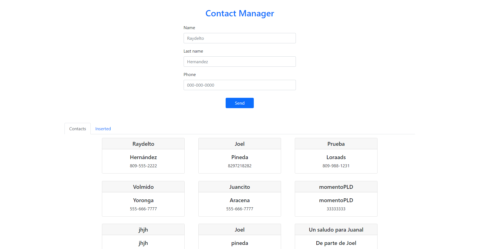
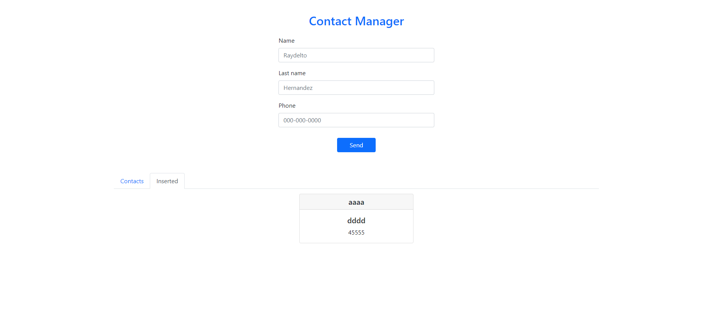

## Tarea NO.4 Programacion WEB

### Casos de uso de las pestañas

#### Pestaña "contacts"

- Permite visualizar todos los contactos servidos por la API.

#### Pestaña "Inserted"

- A modo de historial, guarda los contactos insertados por esa seccion del navegador (localstorage).

